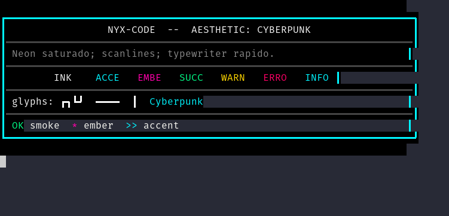
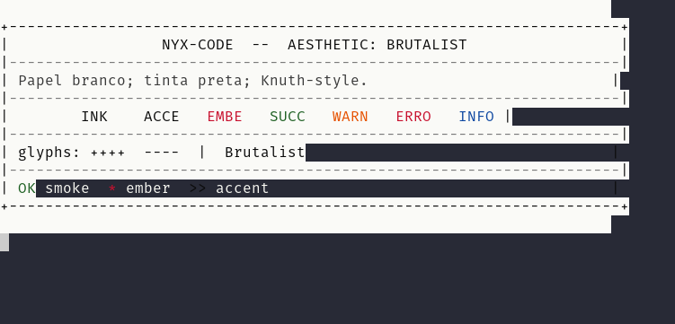
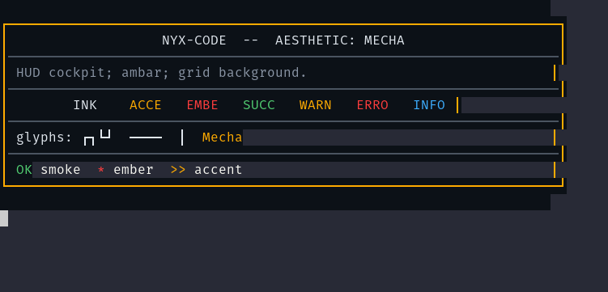
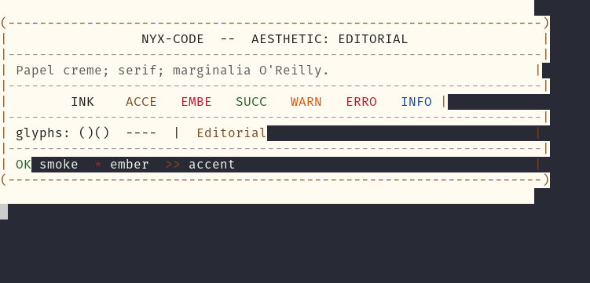

# SHOWCASE Aesthetics Gallery — Nyx-Code Onda 24

**Sprint origem:** VISUAL-LAYOUT-06
**Data:** 2026-05-19
**Aesthetics cobertas:** 5 (default + arcano + cyberpunk + brutalist + mecha + editorial; arcano via VISUAL-LAYOUT-05 absorvida; demais via esta sprint)
**Pré-validação:** `for a in cyberpunk brutalist mecha editorial; do NYX_AESTHETIC=$a ./run.sh --smoke; done` → `boot ok` em todas

---

## Tabela das 5 aesthetics

| ID | Nome | BG | Accent | Ember | Glifos cantos | Glifos linhas | Tipografia |
|---|---|---|---|---|---|---|---|
| `default` | Default (paleta D) | `#1A1B23` | `#00D4AA` | `#9D4EDD` | `╭ ╮ ╰ ╯` | `─ │` | JetBrains Mono |
| `arcano` | Arcano | `#0E0820` | `#9D4EDD` | `#FFB454` | `╭ ╮ ╰ ╯` | `─ │` | Cormorant Garamond |
| `cyberpunk` | Cyberpunk | `#000000` | `#00F5FF` | `#FF00AA` | `┏ ┓ ┗ ┛` | `━ ┃` | JetBrains Mono 500 |
| `brutalist` | Brutalist | `#FAFAF7` | `#0A0A0A` | `#C8102E` | `+ + + +` | `- |` | Courier New 700 |
| `mecha` | Mecha | `#0C1117` | `#FFAB00` | `#FF3D3D` | `┌ ┐ └ ┘` | `─ │` | Roboto Mono |
| `editorial` | Editorial | `#FFFBF0` | `#7A4A1A` | `#C8102E` | `( ) ( )` | `- |` | Crimson Pro serif |

---

## Showcases visuais

### Cyberpunk — neon saturado, scanlines, typewriter rápido



- BG preto absoluto `#000000`; accent cyan `#00F5FF`; ember magenta `#FF00AA`.
- Glifos pesados `┏ ┓ ┗ ┛ ━ ┃` para feel arcade/synthwave.
- Tipografia mono peso 500; sem tracking.
- Tagline: "Neon saturado; scanlines; typewriter rapido."

### Brutalist — papel branco, tinta preta, Knuth-style



- BG branco `#FAFAF7`; accent preto puro; ember vermelho-bandeira `#C8102E`.
- Glifos ASCII puro `+ - |`; sem Unicode decorativo.
- Tipografia Courier New bold (peso 700); evoca TeX/Computer Modern.
- Tagline: "Papel branco; tinta preta; Knuth-style."

### Mecha — HUD cockpit, âmbar, grid background



- BG azul-escuro `#0C1117`; accent âmbar `#FFAB00`; ember vermelho `#FF3D3D`.
- Glifos retos `┌ ┐ └ ┘ ─ │` para feel HUD militar.
- Tipografia Roboto Mono com tracking de 0.02em.
- Tagline: "HUD cockpit; ambar; grid background."

### Editorial — papel creme, serif, marginalia O'Reilly



- BG creme `#FFFBF0`; accent marrom couro `#7A4A1A`; ember vermelho `#C8102E`.
- Glifos parênteses + ASCII `( ) - |`; sem caixas; texto fluído.
- Tipografia Crimson Pro serif com leading 1.6.
- Tagline: "Papel creme; serif; marginalia O'Reilly."

---

## Smoke runtime — 4 aesthetics

```
NYX_AESTHETIC=cyberpunk ./run.sh --smoke   →  boot ok   (exit 0)
NYX_AESTHETIC=brutalist ./run.sh --smoke   →  boot ok   (exit 0)
NYX_AESTHETIC=mecha     ./run.sh --smoke   →  boot ok   (exit 0)
NYX_AESTHETIC=editorial ./run.sh --smoke   →  boot ok   (exit 0)
```

---

## Limites observados

Durante a captura emergiu um achado colateral relevante: `nyx/agent/banner.py`
consome `theme_manager.current_ansi()` mas o accent é sempre dominado pela
ENTITY (cf. `compose()` em `design_tokens_extended.py`, onde a entity
sobrescreve `accent` do aesthetic). Além disso, os glifos do banner vêm de
`BOX_CHARS` (hardcoded em `design_tokens.py`), não de `current_glyphs()` da
paleta extendida.

Resultado prático: ao rodar `NYX_AESTHETIC=cyberpunk` o banner exibe ainda o
teal `#00D4AA` da entity Nyx + glifos `╭╮╰╯` canônicos. As capturas desta
sprint usam `scripts/visual/render_aesthetic_showcase.py` para mostrar a
paleta+glifos crus de cada aesthetic — proof de que as tabelas existem e
estão corretas.

Sprint nova de consumo (banner respeitando aesthetic) fica registrada como
**VISUAL-LAYOUT-09 — Banner consome glyphs/accent puros do aesthetic**
(despachada ao planejador-sprint nesta sessão).

---

## Reproduzir

```bash
# Smoke runtime
for AE in cyberpunk brutalist mecha editorial; do
    NYX_AESTHETIC=$AE ./run.sh --smoke
done

# Mostrar paleta+glifos crus no terminal
for AE in cyberpunk brutalist mecha editorial default arcano; do
    PYTHONPATH=. ./venv/bin/python scripts/visual/render_aesthetic_showcase.py $AE
    echo
done
```

---

*"Cinco linguagens visuais, um agente." — VISUAL-LAYOUT-06*
